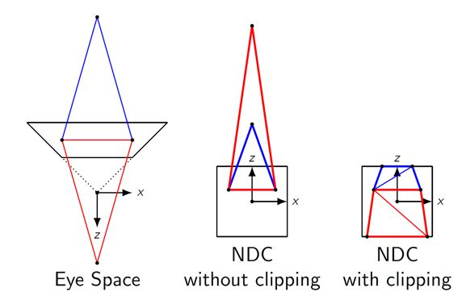
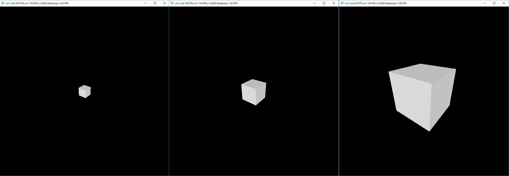
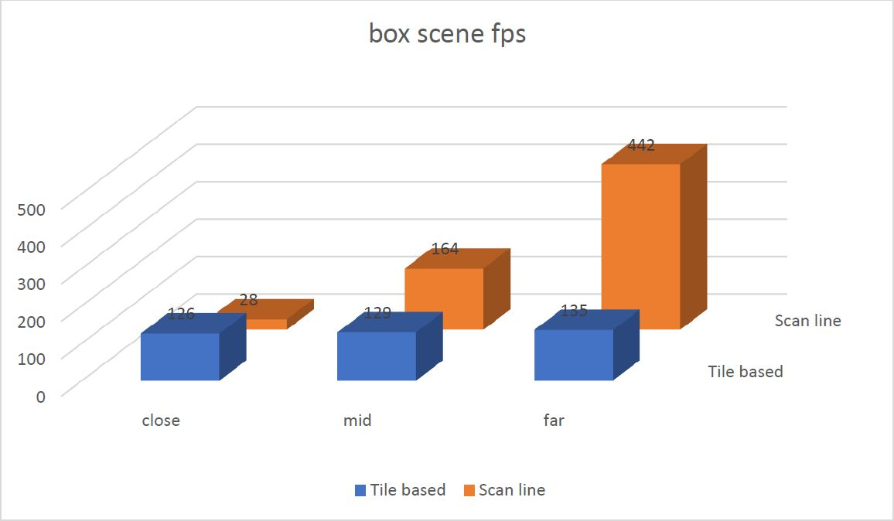
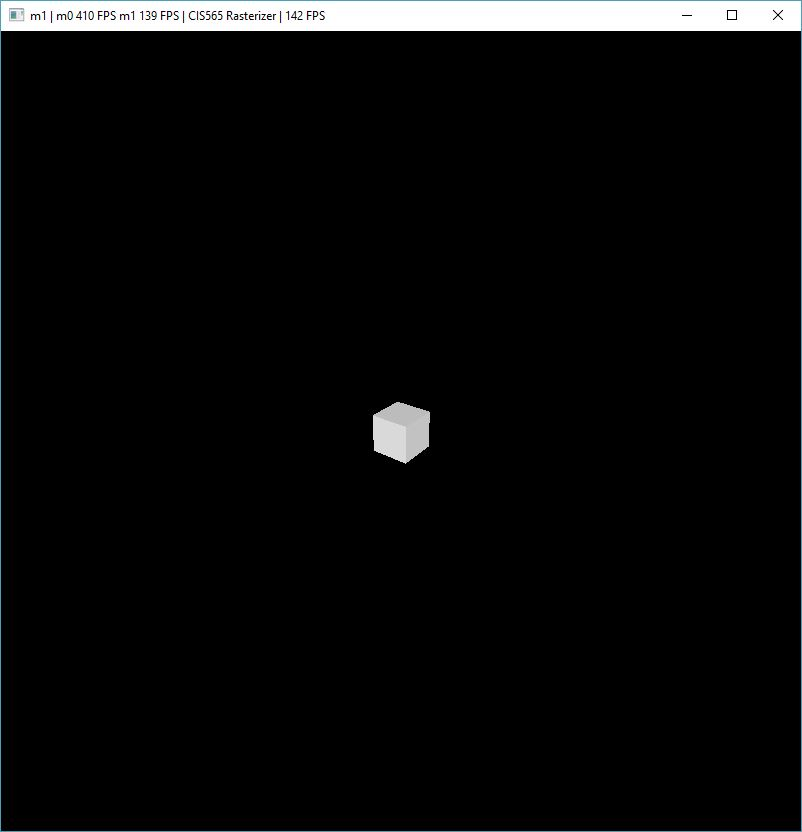
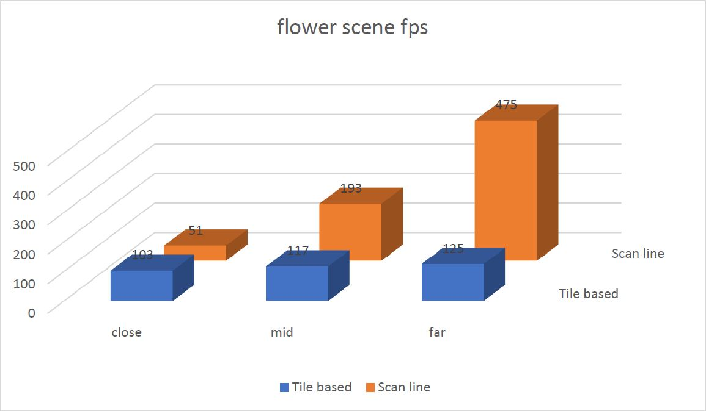
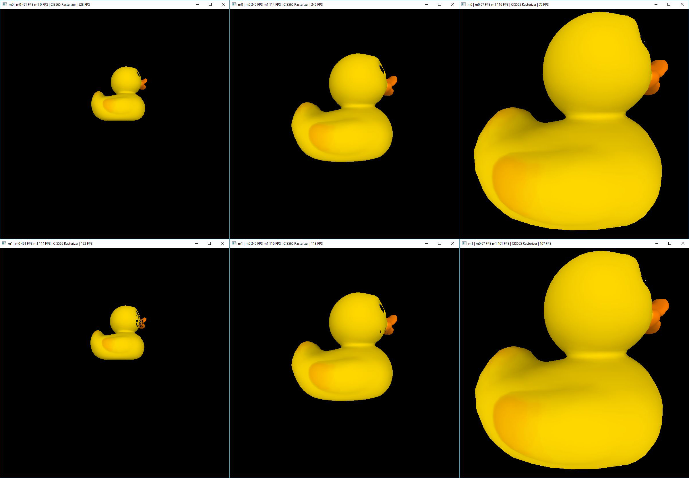
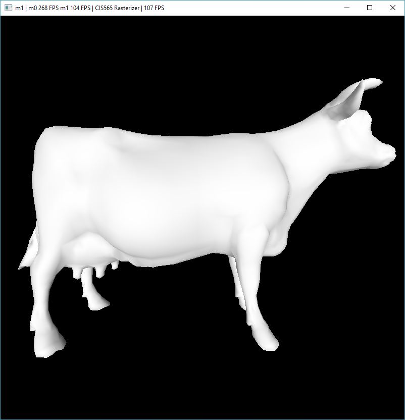

CUDA Rasterizer
===============

* Tested on: Windows 10, i7-7700K @ 4.20GHz 16.0GB, GTX 1080 15.96GB

Analysis 
======================

* When parallelize primitives, blocksize is set to 128 unchanged.

* When parallelize pixels, blocksize is set to 25 x 25 unchanged.

* For shared memory in tile based rasterizer, primitive bucket size is 256 unchanged.

* Rendering time is measured in frame per second, higher is better.

---

## 0. First thing first

### In this project, the scan line rasterizer will crash when mesh goes behind the camera but tile based rasterizer won't

This is because the vertex behind the camera will be projected to the far end of the clip space as shown in the following picture. 

###### picture credit [derhass@stackoverflow](https://stackoverflow.com/users/2327517/derhass)

As a restul, the primitive will potentially occupy more pixels, which will result in longer looping time in scan line rasterizer. If the the execution time for a kernel is too long, GPU will throw a kernel launch failure error. There are two ways to avoid this. The standard way is to perform a depth clipping. But this requires a clipping stage and a clipping algorithm, which we do not have in our CUDA rasterizer(if you want to know more about clipping, check [this](https://stackoverflow.com/questions/41085117/why-does-gl-divide-gl-position-by-w-for-you-rather-than-letting-you-do-it-your) out). So I used the other option which is a tile based rasterizer. Tile based rasterizer solves this problem by parallelize the pixels. And since the size of the primitive bucket of each tile can be adjusted, we can actually control the execution time for the kernel to avoid crashing. 

---

## 1. Checkerboard Scene 

### overview

### rendering time

### analysis

In this scene, tile based rasterizer is better in all distance. This is because when we use scan line rasterizer, we parallelize the primitives and the primitives are so few in this scene (only two triangles) therefore we can not utilize parallel processing efficiently. Even worse, when the two triangles cover a lot of pixels, we are spending two much time in each thread looping through the pixels which will impact parallelism further. However, when we use tile based rasterizer, we parallelize the pixels. For each pixel, it only needs to worry about the primitive that overlaps the tile it belongs to. In this scene, there will be two in the worst scenario, which means the looping for each pixel will be very short and that means we are exploiting the most out of parallelism.

### images

* checkerboard far distance
  

* checkerboard mid distance
  

* checkerboard near distance
  

---

## 2. Box Scene 

### overview

### rendering time

### analysis

In the box scene, scan line rasterizer is doing better at far distance because each primitive takes less pixel and there are more primitives than in the checkerboard scene. But as the mesh moves closer to the camera, performance of tile based rasterizer remain the same whereas performance of scan line rasterizer is getting worse because the workload for each thread increases as the primitive covers more pixels.

### images

* box far distance
  

* box mid distance
  

* box near distance
  

---

## 3. Flower Scene 

### overview

### rendering time

### analysis

Just like the box scene, the performance of scan line rasterizer starts to get worse as the mesh moves closer to the camera whereas the performance of tile based rasterizer almost remains the same.

### images

* flower far distance
  

* flower mid distance
  

* flower near distance
  

---

## 4. Duck Scene 

### overview (tile based rasterizer is the second row)

### rendering time

### analysis

Just like the box scene, the performance of scan line rasterizer starts to get worse as the mesh moves closer to the camera whereas the performance of tile based rasterizer almost remains the same. 

But there is something else worth noticing. When the mesh is far away, you can spot some black triangles on the rendered image. This is because the shared memory being used to store primitives for each tile(block) is not large enough to hold all the potential triangles. Therefore, some triangles that contributes to the rendering are not cached in the shared memory. And if you run the program, you can see the black triangles are flickering, which means, for each frame, the triangles which belongs to a tile but not cached are not the same one. This is because the process of caching the potential triangles runs in parallel within each tile(block), and the run time of this process in one thread is not guaranteed to be the same for every frame, sometime slightly faster, sometime slightly slower. So when one thread is fast enough to use atomicadd to lock the slot and cache the primitve in one frame, it might not be as quick in the next frame and other threads who is faster may do the same thing before this thread gets a chance.

One solution to solve the flickering triangle is to use a better algorithm to check whether a triangle will contribute to a tile or not. Currently, I’m only using AABB to check if they overlap. This is a conservative way to do it which means it will give you a triangle whose AABB overlaps the tile but itself doesn’t. As a result, they will occupy the limited shared memory slot which is supposed for triangles that actually overlaps the tile. This is also the reason why the black triangles disappear when the mesh is closer. When the mesh is closer, the AABB overlapping test rejects more easily resulting in less falsely occupied shared memory slot.

Another solution is to use global memory to store primitives for each tile(block), just like a [previous implementation](https://github.com/Aman-Sachan-asach/CUDA-Rasterizer) of this project did. But I don’t think that makes sense at all. Because from what I read online, tile based rendering utilize "on chip" memory to compensate for scarce global memory and its low accessing speed. And since "on chip" is equivalent to "shared memory" in CUDA lingo, I think it’s better to use it instead of global memory as the primitive buckets.

To summarize, tile based rasterizer solves the limited bandwidth problem by two aspects. The first aspect is to lower the bandwidth of the rendering process by only rendering a part of the framebuffer (i.e. a tile) at a time. The second aspect is to increase efficiency by parallelize pixels instead of primitives, because we have more pixels than premitives per tile. An optimization on the second part is to store global data (i.e. all primitive data since we are parallelizing pixels) in the "on chip" memory.

### images

* duck far distance scan line
  

* duck far distance tile based
  

* duck mid distance scan line
  

* duck mid distance tile based
  

* duck near distance scan line
  

* duck near distance tile based
  

---

## 5. Cow Scene 

### overview (tile based rasterizer is the second row)

### rendering time

### analysis

There is something new worth noticing. This is the only scene in all the five scenes where the performance of tile based rasterizer is worse than scan line rasterizer when the mesh is close to the camera. One of reasons might be the triangles are relatively small in terms of pixels they occupy. This is good when we parallelize the primitives since one thread will not loop for too long which means we are distributing works among appropriate amount of threads. On the other hand, for tile based rasterizer, small triangles means for each tile(block), there will be more primitives stored in their shared memories, therefore each thread will loop for a longer time. This means we are not distributing our works appropriately. 

### images

* cow far distance scan line
  

* cow far distance tile based
  

* cow mid distance scan line
  

* cow mid distance tile based
  

* cow near distance scan line
  

* cow near distance tile based
  

---

## 6. Summary

* Tile based rasterizer is better when primitives are few but occupied pixels are many.(Simple mesh near distance)

* Scan line rasterizer is better when primitives are many but occupied pixels are few.(Complex mesh far distance)

* Using shared memory for tile based rasterizer requires a more accurate(less conservative) algorithm to check whether a primitive should be cached.

---

### Credits

* [tinygltfloader](https://github.com/syoyo/tinygltfloader) by [@soyoyo](https://github.com/syoyo)
* [glTF Sample Models](https://github.com/KhronosGroup/glTF/blob/master/sampleModels/README.md)
* [Why does GL divide gl_Position by W for you rather than letting you do it yourself?](https://stackoverflow.com/questions/41085117/why-does-gl-divide-gl-position-by-w-for-you-rather-than-letting-you-do-it-your)
* [fabian's a trip through the graphics pipeline](https://fgiesen.wordpress.com/2011/07/06/a-trip-through-the-graphics-pipeline-2011-part-6/)
